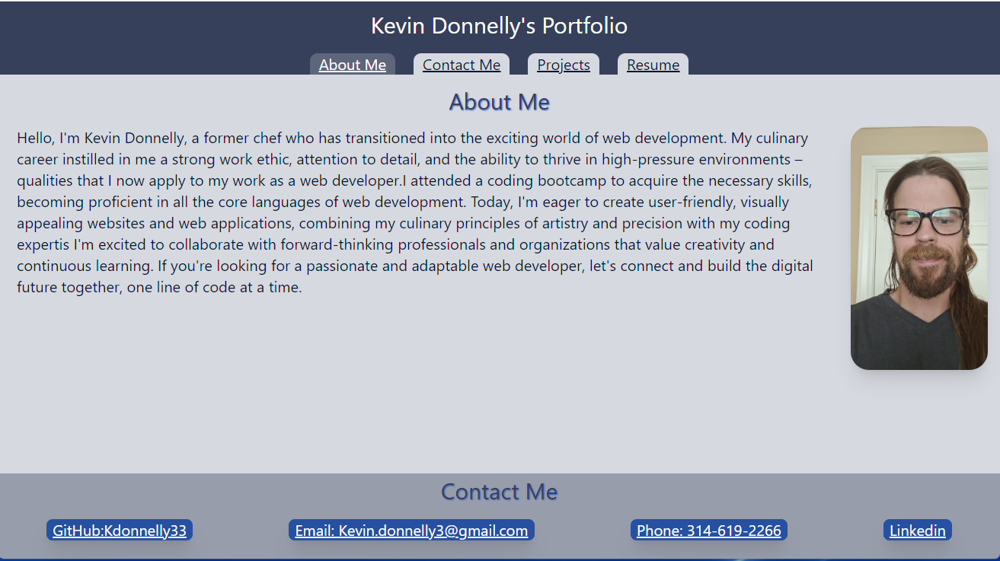
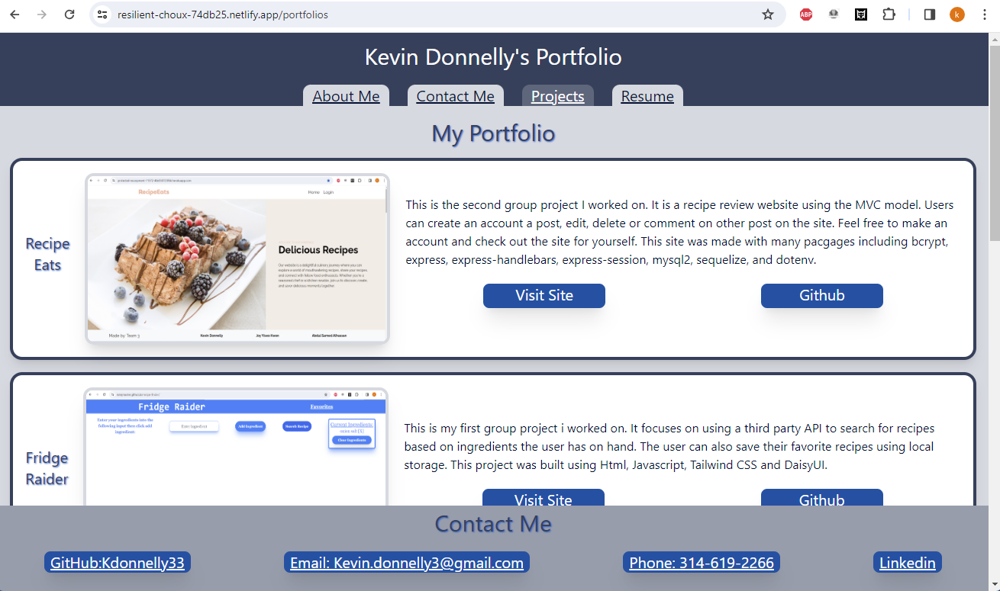
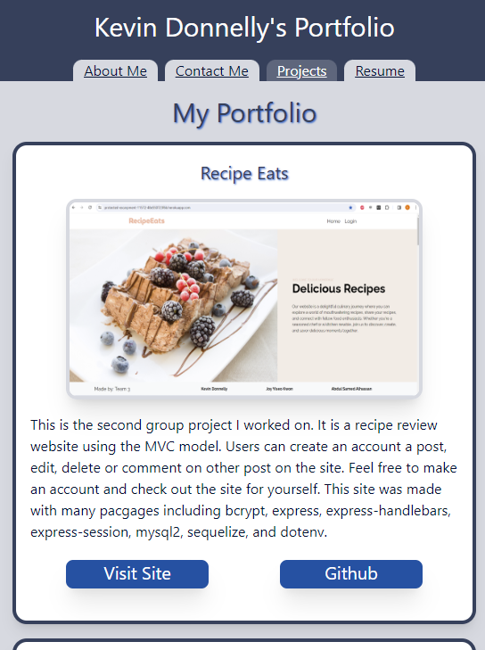
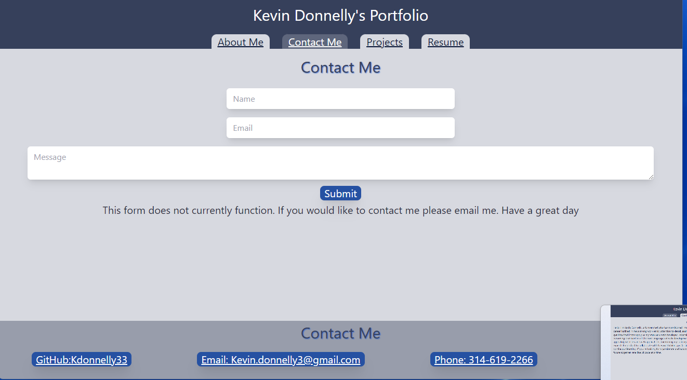
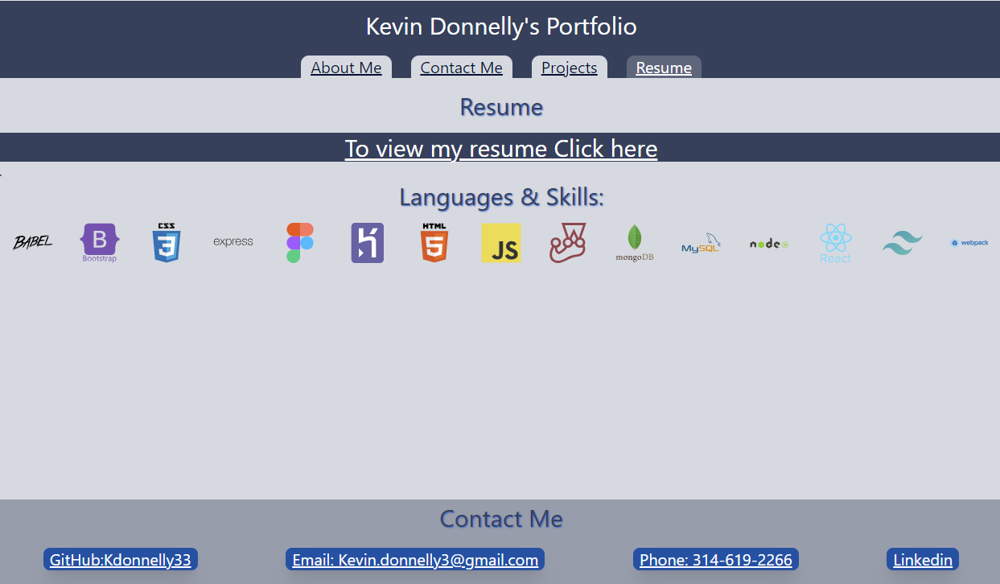

# Portfolio-React

## Description
This is a portfolio page made with react. On the main page you will see an about me and a profile picture. You can click on the links in the navbar to go to the other pages. The projects page has a list of projects that I have worked on. The contact page has a form that you can fill out to contact me. The resume page has a link to my resume and a list of my skills.

## Links
[Deployed Application](https://resilient-choux-74db25.netlify.app/)
[GitHub Repository](https://github.com/KDonnelly33/portfolio-react)

## Screenshots

   

